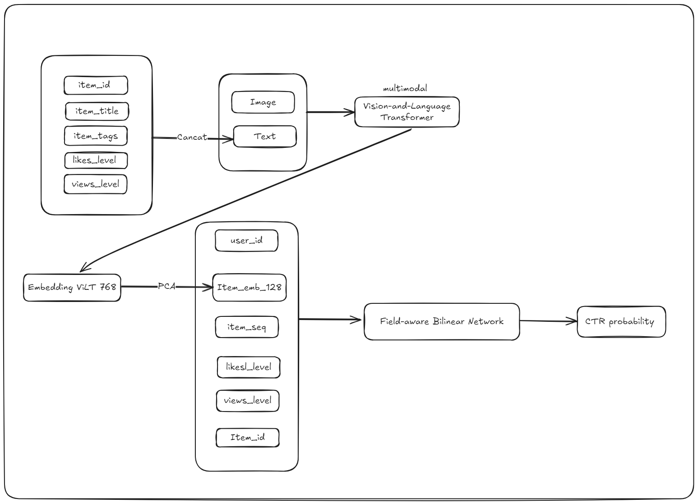

# MM-CTR Track 2 — Multimodal CTR Prediction (MM-FiBiNET)

Ce repo implémente un pipeline **CTR Prediction multimodal** (texte + image + features tabulaires) pour le challenge **MM-CTR (Track 2)**.  
L’idée : **construire/mettre à jour des embeddings item (ex: 128-d)** à partir du **texte brut** + **image**, puis entraîner un modèle CTR (**FiBiNET**) sur MicroLens.

> Entraînement réalisé sur Kaggle (GPU).
> Score obtenu : ~0.95 AUC après 7 époques.
---

## Contexte

Dans MicroLens, chaque item contient des infos multimodales (titre/tags + image).  
Les features tabulaires seules ne suffisent pas toujours : on améliore la qualité des prédictions CTR en ajoutant un **vecteur item** qui résume :
- le **contenu textuel** (titre, tags, description si dispo),
- le **contenu visuel** (image),
- puis on l’injecte dans un modèle CTR.

---

## Architecture (pipeline)



---
## Structure du projet

```bash
.
├─ data/
│  └─ MicroLens_1M_x1/
│     ├─ train.parquet
│     ├─ valid.parquet
│     ├─ test.parquet
│     ├─ item_info.parquet
├─ configs/
│  └─ fibinet_config.yaml
├─ Notebooks/
│  └─ task1.ipynb
│  ├─ train_predict_kaggle.ipynb 
├─ src/
│  ├─ train_fibinet.py
│  ├─ prediction.py
│  └─ utils/
├─ checkpoints/
└─ README.md
```

---


### Kaggle

* Active **GPU**
* Ajoute le dataset MicroLens à ton notebook
* Vérifie que tes chemins pointent vers `/kaggle/input/...`

---

## Training (Kaggle)

### 1) Task 1 — Générer / mettre à jour `item_info` avec `item_emb_d128`

Objectif : produire un fichier **`item_info_updated.parquet`** (ou remplacer `item_info.parquet`) contenant la colonne :

* `item_emb_d128` : liste de **128 floats** par item (embedding multimodal)

Exemple :

```bash
python src/task1_build_item_embedding.py \
  --item_info /kaggle/input/.../item_info.parquet \
  --output    /kaggle/working/item_info_updated.parquet \
  --emb_dim   128
```

✅ Sortie attendue : un parquet avec **la même structure** + une colonne `item_emb_d128` (ou une colonne existante mise à jour).

---

### 2) Task 2 — Entraîner FiBiNET

Assure-toi que ton `config` pointe vers le bon `item_info` :

* `train_data`: `train.parquet`
* `valid_data`: `valid.parquet`
* `test_data` : `test.parquet`
* `item_info`: `item_info_updated.parquet` (ou le `item_info.parquet` remplacé)

```bash
python src/train_fibinet.py --config configs/fibinet_config.yaml
```

✅ Sorties :

* `checkpoints/` : meilleur modèle (best checkpoint)
* `logs/` : logs d’entraînement (loss/AUC, etc.)

---

## Prediction & Submission

### 1) Générer les prédictions sur `test.parquet`

```bash
python src/prediction.py \
  --config configs/fibinet_config.yaml \
  --checkpoint checkpoints/best.ckpt \
  --test data/MicroLens_1M_x1/test.parquet \
  --out /kaggle/working/submission.csv
```

### 2) Créer le zip de soumission

```bash
zip -r submission.zip /kaggle/working/submission.csv
```


---

## Reproducibility

* Fixer le seed (`seed: 2025`)
* Sauvegarder le meilleur modèle (`save_best_only: True`)
* Noter :

  * `embedding_dim`
  * features utilisées
  * version des libs (torch, pandas, etc.)
  * configuration Kaggle (GPU/driver)

---


---

## Références

* Challenge MM-CTR Track 2 (site & règles)
* FiBiNET: Field-wise Bi-Interaction Network for CTR Prediction
* MicroLens dataset (format & description)


